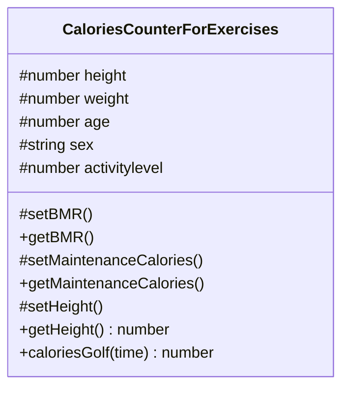

# Mall för inlämning laboration 1, 1dv610

## Author: Daniel Carlsson <dc222bz@student.lnu.se>

## Checklista
  - [x] Jag har skrivit all kod och reflektioner själv. Jag har inte använt mig av andras kod för att lösa uppgiften.
  - [x] Mina testresultat är skrivna utifrån utförd testning ( och inte teoretiskt: "det bör fungera" :) )
  - [x] Koden är objektorienterad
  - [x] Jag har skrivit en modul som riktar sig till programmerare
​
## Egenskattning och mål
  - [ ] Jag är inte klar eftersom jag vet att jag saknar något. (Då skall du inte lämna in! Lämna då istället in på restlaboration.)
  - [x] Jag eftersträvar med denna inlämning godkänt betyg (E-D)
    - [x] De flesta testfall fungerar
    - [x] Koden är förberedd på Återanvändning
    - [x] All kod samt historik finns i git 
    - [x] Kodkvaliterskraven är ifyllda
    - [x] Reflektion är skriven utifrån bokens kapitel 
  - [x] Jag eftersträvar med denna inlämning högre betyg (C-B) och anser mig uppfylla alla extra krav för detta. 
    - [x] Samtliga testfall är skrivna    
    - [x] Testfall är automatiserade
    - [x] Det finns en tydlig beskrivning i hur modulen skall användas (i git)
    - [x] Kodkvalitetskraven är varierade 
  - [x] Jag eftersträvar med denna inlämning högsta betyg (A) 
​
Förtydligande: Examinator kommer sätta betyg oberoende på vad ni anser. 
​
## Återanvändning
För att enkelt förstå vad min kod i modulen gör finns JAVADOC kommentarer för huvudklass och underliggande metoder, där inputs och outputs finns förklarade.
I min README.md finns kort beskrivning vad modulen är till för och hur den kan installeras och användas. [Länk till README.md](https://github.com/dc222bz/1DV610-Laboration1/blob/main/README.md)
​
## Beskrivning av min kod

Min modul är till för att man ska kunna beräkna sitt kaloribehov smidigt, samt beräkna hur många kalorier man kan förbränna för olika träningaktiviteter. Utvecklare kan t.ex.använda denna module för att räkna på olika resultat utifrån träningsupplägg.


### Exempel på användning.

```js
import { CaloriesCounterForExercises } from '../module/caloriesCounterForExercises.js'

const person = new CaloriesCounterForExercises(185, 79, 31, 'male', 1.4)

const bmi = person.getBMI()

const maintenaceCalories = person.getMaintenanceCalories()

const caloriesBurned = person.caloriesRunning(45)
```

​
## Hur jag testat
Automatiska enhetstesterna genomfördes med testverktyget JEST.
Och två olika instanser av modulen skapades en manlig och en kvinnlig eftersom ekvationen för BMR ser olika ut för dessa. Sedan testades enligt tabellerna nedanför tvår olka sortes tester en med korrekta inmatningar och en med felaktiga inmatningar. Koden för testningen hittar ni här, [testkod](https://github.com/dc222bz/1DV610-Laboration1/blob/main/test-app/test-app.test.js)
​
### Testfall

<table>
<caption><b>Tester med korrekta inmatningar</b></caption>
<thead><tr><th>Vad som testats</th><th>Hur det testats</th><th>Testresultat</th></tr></thead>
<tbody>
<tr><td>Metoden getWeight testas.</td><td>Automatiskt enhetstest</td><td>OK</td></tr>

<tr><td>Metoden geHeight testas.</td><td>Automatiskt enhetstest</td><td>OK</td></tr>

<tr><td>Metoden getAge testas.</td><td>Automatiskt enhetstest</td><td>OK</td></tr>

<tr><td>Metoden getSex testas.</td><td>Automatiskt enhetstest</td><td>OK</td></tr>

<tr><td>Metoden getActivityLevel testas.</td><td>Automatiskt enhetstest</td><td>OK</td></tr>

<tr><td>Metoden getBMR testas.</td><td>Automatiskt enhetstest</td><td>OK</td></tr>

<tr><td>Metoden getMaintenanceCalories testas.</td><td>Automatiskt enhetstest</td><td>OK</td></tr>

<tr><td><b>Olika träningsmetoder testas hur många calorier dem förbränner under 60 minuter (exerciseCalories).</b><br>
Metoden caloriesBadminton<br>
Metoden caloriesBeachVolleyball<br>
Metoden caloriesGolf<br>
Metoden caloriesHandball<br>
Metoden caloriesIcehockey<br>
Metoden caloriesRollerblading<br>
Metoden caloriesRunning<br>
Metoden caloriesSoccer<br>    
Metoden caloriesSwimming<br>
Metoden caloriesTennis<br>
Metoden caloriesWalking<br>
Metoden caloriesWeightTraning<br>
</td><td>Automatiskt enhetstest</td><td>OK</td></tr>
</tbody>
</table>
<br>

<table>
<caption><b>Tester med felaktiga inmatningar: <br>felaktigt intervall, string, null, boolean och undefined</b></caption>
<thead><tr><th>Vad som testats</th><th>Hur det testats</th><th>Testresultat</th></tr></thead>
<tbody>
<tr><td>Metoden getWeight testas.</td><td>Automatiskt enhetstest</td><td>OK</td></tr>

<tr><td>Metoden geHeight testas.</td><td>Automatiskt enhetstest</td><td>OK</td></tr>

<tr><td>Metoden getAge testas.</td><td>Automatiskt enhetstest</td><td>OK</td></tr>

<tr><td>Metoden getSex testas.</td><td>Automatiskt enhetstest</td><td>OK</td></tr>

<tr><td>Metoden getActivityLevel testas.</td><td>Automatiskt enhetstest</td><td>OK</td></tr>

<tr><td>
Metoden caloriesBadminton<br>
Metoden caloriesBeachVolleyball<br>
Metoden caloriesGolf<br>
Metoden caloriesHandball<br>
Metoden caloriesIcehockey<br>
Metoden caloriesRollerblading<br>
Metoden caloriesRunning<br>
Metoden caloriesSoccer<br>    
Metoden caloriesSwimming<br>
Metoden caloriesTennis<br>
Metoden caloriesWalking<br>
Metoden caloriesWeightTraning<br>
</td><td>Automatiskt enhetstest</td><td>OK</td></tr>
</tbody>
</table>
<br>

```bash
> laboration1@1.0.0 test
> npx --node-options=--experimental-vm-modules jest || exit 0

(node:11400) ExperimentalWarning: VM Modules is an experimental feature. This feature could change at any time
(Use `node --trace-warnings ...` to show where the warning was created)
 PASS  test-app/test-app.test.js
  test right input
    √ Weight (5 ms)
    √ Height (1 ms)
    √ Age (1 ms)
    √ Sex
    √ Activitly Level (2 ms)
    √ calculate BMR (1 ms)
    √ maintenanceCalories (1 ms)
    √ exerciseCalories (4 ms)
  test wrong input
    √ Weight (7 ms)
    √ Height (1 ms)
    √ Age (1 ms)
    √ Sex (3 ms)
    √ Activitly Level (1 ms)
    √ exerciseCalories (111 ms)

Test Suites: 1 passed, 1 total
Tests:       14 passed, 14 total
Snapshots:   0 total
Time:        1.747 s, estimated 3 s
Ran all test suites.
```
​
​
## Kodkvalitetskrav
### Namngivning
Snabblänkar: <br>
[CaloriesCounterForExercises](https://github.com/dc222bz/1DV610-Laboration1/blob/main/module/caloriesCounterForExercises.js#L13) <br>
[getBMR](https://github.com/dc222bz/1DV610-Laboration1/blob/main/module/caloriesCounterForExercises.js#182) <br>
[getMaintenanceCalories](https://github.com/dc222bz/1DV610-Laboration1/blob/main/module/caloriesCounterForExercises.js#L190) <br>
[getWeight](https://github.com/dc222bz/1DV610-Laboration1/blob/main/module/caloriesCounterForExercises.js#L81) <br>
[caloriesGolf](https://github.com/dc222bz/1DV610-Laboration1/blob/main/module/caloriesCounterForExercises.js#L314)
<table>
<thead><tr><th>Namn och förklaring</th><th>Reflektion och regler från Clean Code</th></tr></thead>
<tbody>
<tr><td><b>CaloriesCounterForExercises</b><br>
Klassnamn på huvudklassen i modulen.</td>
<td><b>Class Names</b><br>
Borde vara ett substantiv vilket bodre ändras till CalorieCounter, vilket är ett bättre samlingsnamn för hela modulen. Skulle man vilja lägga in flera nya metoder för att beräkna calorier på olika sätt, så kan man det utan att Klassnamnet ska vara vilseledande.
</td></tr>

<tr><td><b>getBMR</b><br>
Metod som returnerar en persons basalmetabolism.</td>
<td><b>Avoid Disinformation</b><br>
Förkortning som kan mistolkas av läsaren, borde uppdateras till getBasalMetabolicRate.
</td></tr>

<tr><td><b>getMaintenanceCalories</b><br>
Metod som returnerar en persons aktivitetsomsättning.</td><td><b>Add Meaningful Context</b><br>
Borde förtydliga vilken sorts "maintenance calories" man returnerar, borde bytas till getActiveMetabolicRate.</td></tr>

<tr><td><b>getWeight</b><br>
Metod som returnerar personens vikt.</td>
<td><b>Add Meaningful Context</b><br>
Borde lägga till vems vikt man syftar på, t.ex. getPersonWeight.
.</td></tr>

<tr><td><b>caloriesGolf</b><br>
Metod som beräknar hur många kalorier som man förbränner när man spelar golf.</td>
<td><b>Method Names</b><br>
Metoder ska börja med ett verb, t.ex. burnedCaloriesGolf.
</td></tr>
</tbody>
</table>
<br>

### Min reflektion på kapitel 2 - Namngivning
Summeringen av kapitel 2 är att namnge identifierare är inte lätt utan kräver fullt focus och att man tänker på att andra ska kunna förstå dessa utan att behöva speciel kunskap om koden. Brister hos mig finns massa vid namngivning men efter denna kurs borde dessa bli färre. Att metodnamn ska börja med ett verb hade jag inte fullkoll på och att man tänker på att "Add Meaningful Context" när man beräknar saker, så man vet till vad resultatet tillhör.

Dessutom att man undviker förkortningar är en bra tumregel, för att med dessa är sannolikheten stor att någon som läser koden kommer att misstolka den eller att förkortning betyder något helt annat än vad man använder den till i koden.

Vid kodning så är man oftast i problemlösningsmode vilket oftast leder till att man inte alltid tänker på vad sina identifierare namges till. Viktigt här att man tar sig tid att gå igenom koden och reflektera på alla identifierare man skapat efter problemet är löst.

Detta med namngivning blir själklart bättre ju mer kod man skriver och läser, samt sammarbetar med andra i projekt där alla måste kunna förstå koden som man arbetar med. Så att slutligen med mera erfarenhet borde namngivningen bli bättre också får man hoppas...

<br>

### Funktioner
Snabblänkar: <br>
[setMaintenanceCalories](https://github.com/dc222bz/1DV610-Laboration1/blob/main/module/caloriesCounterForExercises.js#L190) <br>
[setActivityLevel](https://github.com/dc222bz/1DV610-Laboration1/blob/main/module/caloriesCounterForExercises.js#136) <br>
[setSex](https://github.com/dc222bz/1DV610-Laboration1/blob/main/module/caloriesCounterForExercises.js#L112) <br>
[setBMR](https://github.com/dc222bz/1DV610-Laboration1/blob/main/module/caloriesCounterForExercises.js#L167) <br>
[checkInput](https://github.com/dc222bz/1DV610-Laboration1/blob/main/module/caloriesCounterForExercises.js#L234)
<table>
<thead><tr><th>Metodnamn och länk eller kod</th><th>Antal rader</th><th>Reflektion</th></tr></thead>
<tbody>
<tr><td><b>setMaintenanceCalories()</b></td><td>16</td><td><b>Don't Repeat Yourself</b><br>I denna metod har jag hämtar jag data från två andra metoder och returnerar produkten av dessa.</td></tr>

<tr><td><b>setActivityLevel(activityLevel)</b></td><td>17</td><td><b>Use Descriptive Names</b><br>Här försöker jag förklara vad metoden gör med ett lite längre namn. </td></tr>

<tr><td><b>setSex()</b></td><td>9</td><td><b>Use Descriptive Names</b><br>Här försöker jag förklara vad metoden gör med ett kort och enkelt namn. </td></tr>

<tr><td><b>setBMR()</b></td><td>9</td><td><b>Use Descriptive Names</b><br>Här kan jag namngett metoden tydligare t.ex. setBasalMetabolicRate. </td></tr>

<tr><td><b>checkInput(time)</b></td><td>8</td><td><b>Error Handling Is One Thing</b><br>Här har jag löst ut felhanteringen för imatning av tid till andra metoder.</td></tr>
</tbody>
</table>

<br>

### Min reflektion på kapitel 3 - Funktioner
Min huvudpoäng att ta ifrån kapitel 3 är att funktioner endast sak göra en sak, fokuserar man på detta får man mycket vunnet. Att sin berättelse med koden blir mer lättläst, vilket också var en slutpoäng från kapitel 3. Dessutom om man håller ner funktionerna till att endast göra en sak blir det svårare att upprepa att koda samma problem flera gånger.

I mitt fall är detta mitt främsta misstag att man skriver flera if/ else satser i samma funktion och på så sätt försämrar läsbarheten.

Slutligen blir funktionsskapadet bättre med mera erfarenhet och med att man läser och försöker förstå andras funktioner.
​
## Laborationsreflektion

En bra laboaration som får en att tänka till hur man ska förklara sin kod till andra på ett sätt som de flesta programmmerare kan förstå. Framför allt hur en README.md file ska vara struktuerad för att användare snabbt ska kunna värdera om modulen är användbar för dem eller ej. 

Sen när användare bestämt sig för att använda modulen att dem kan förstå namnen på klasser och metoder. Att dem beskriver vad dem är tänkta att utföra, dock gillade inte boken kommentarer men jag tycker JAVADOC är perfekt att beskriva hur klasser och metoder fungerar. 

Att använda sig av olika abstraktionsnivåer för att få en god läsbarhet och trycka på att en metod ska endast utföra en sak är grundpelare i Clean Code för att maximera läsbarheten.

Överlag ger denna laborationen bra tankar och lärdomar att ta med sig i sin forsatta programmeringssammabete med andra programmerare, för att man ska förstå varandra.
